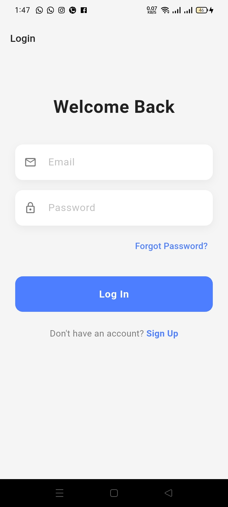
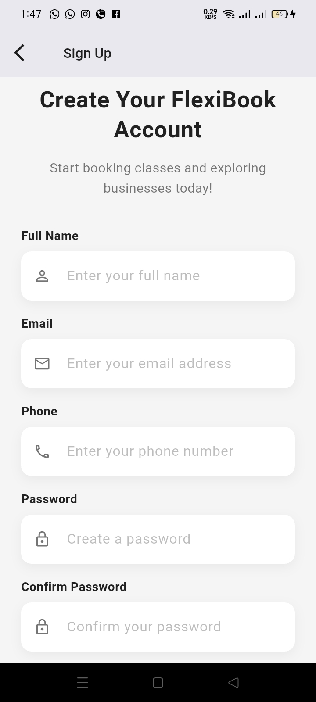
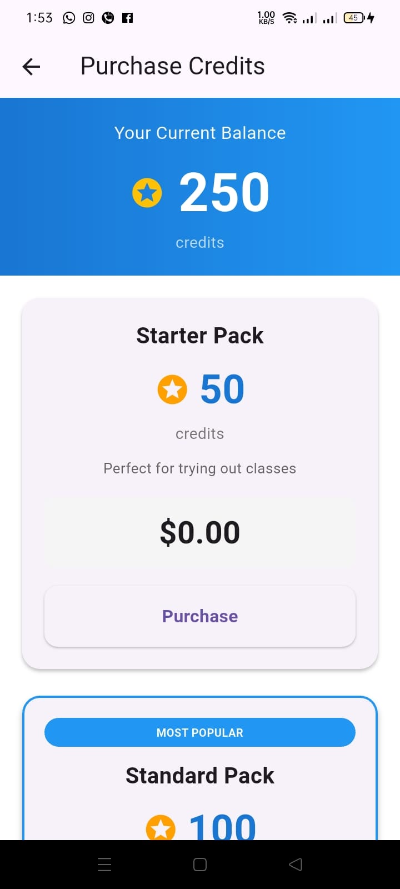
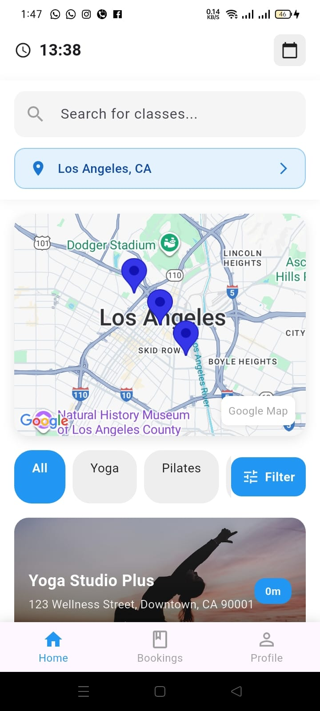
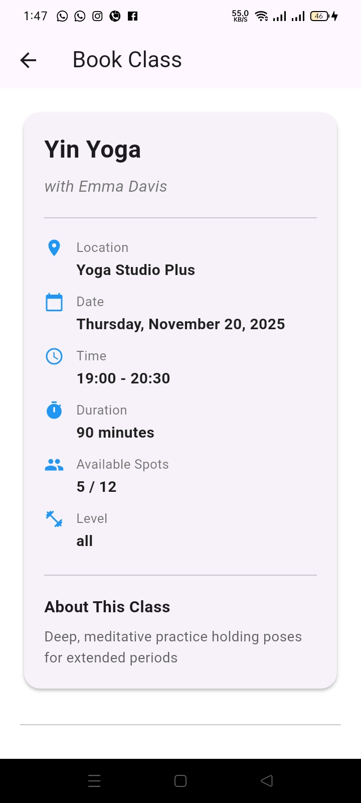
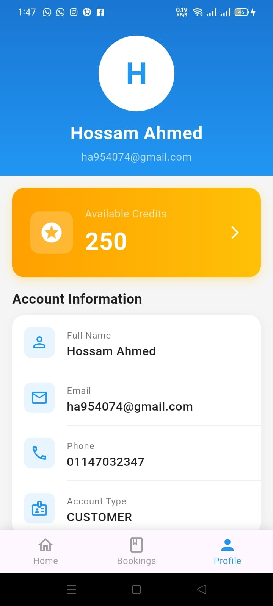
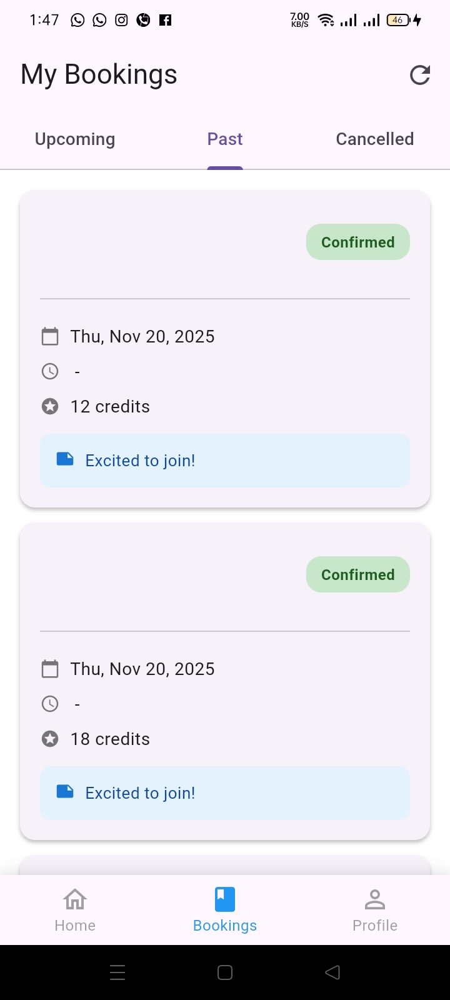
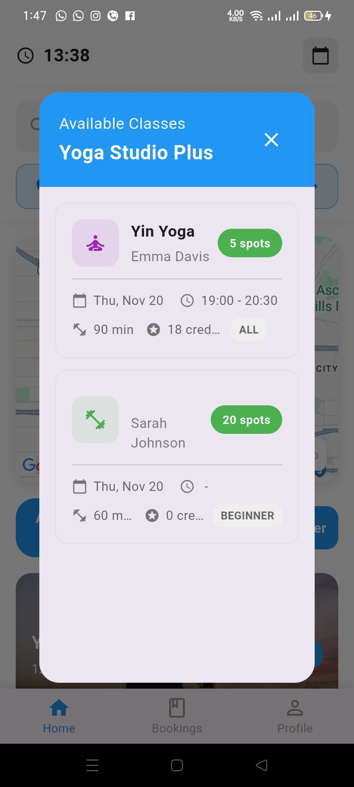

<div align="center">

# 📅 Customer Booking App

[](https://flutter.dev)
[](https://dart.dev)
[](https://opensource.org/licenses/MIT)
[](http://makeapullrequest.com)

**A modern, feature-rich Flutter application for seamless class and service booking**

[Features](#-features) • [Tech Stack](#-tech-stack) • [Architecture](#-architecture) • [Installation](#-installation--setup) • [Testing](#-testing)

</div>

---

## 🎯 About The Project

**Customer Booking** is a professionally crafted Flutter mobile application designed to revolutionize the way users book classes and services. Built with **Clean Architecture** principles and modern development practices, this app delivers a smooth, intuitive experience across both iOS and Android platforms.

### Why This App Stands Out

- 🎨 **Modern UI/UX Design** - Sleek, responsive interface with attention to every detail
- ⚡ **High Performance** - Optimized for speed and efficiency
- 🏗️ **Clean Architecture** - Separation of concerns with data, domain, and presentation layers
- 📱 **Cross-Platform** - Single codebase for iOS and Android
- 🔒 **Secure Authentication** - Robust user authentication flow
- 🗺️ **Location-Based Services** - Integrated Google Maps for location discovery
- 💳 **Credit System** - Flexible payment and credit management
- 🔔 **Real-time Updates** - Stay informed with instant notifications
- 🌐 **RESTful API Integration** - Seamless backend communication with robust error handling

---

## ✨ Features

### Core Functionality

- 🔐 **User Authentication**
  - Secure login and registration
  - Session management with persistent storage
  - Token-based authentication
  - Password validation and security

- 🔍 **Advanced Search & Discovery**
  - Real-time search functionality
  - Filter and sort options
  - Category-based browsing
  - Smart recommendations

- 📍 **Location Services**
  - Google Maps integration
  - Geolocation support
  - Location-based class discovery
  - Distance calculation
  - Map markers for service locations

- 📅 **Booking Management**
  - Browse available classes and services
  - Real-time availability checking
  - Booking confirmation system
  - Booking history and tracking
  - Cancellation and rescheduling

- 💰 **Credit System**
  - Credit balance management
  - Purchase and top-up functionality
  - Transaction history
  - Credit-based payments

- 👤 **User Profile**
  - Personal information management
  - Profile customization
  - Booking history
  - Preferences and settings

### Technical Features

- 🎨 **Responsive Design**
  - Adaptive layouts for all screen sizes
  - Portrait and landscape support
  - Tablet optimization

- 🌓 **Theme Support**
  - Light and dark mode ready
  - Customizable color schemes

- ⚠️ **Robust Error Handling**
  - User-friendly error messages
  - Network failure recovery
  - Input validation
  - Exception handling with Either pattern

- 🔄 **State Management**
  - BLoC pattern implementation
  - Reactive UI updates
  - Efficient state handling

- 📡 **API Integration**
  - RESTful API communication
  - Request/response interceptors
  - Token refresh mechanism
  - Offline capability support

---

## 🛠️ Tech Stack

### Frontend


### Core Libraries

| Technology | Purpose | Version |
|------------|---------|---------|
| **flutter_bloc** | State Management | ^9.1.1 |
| **dio** | HTTP Client & API Integration | ^5.9.0 |
| **go_router** | Navigation & Routing | ^17.0.0 |
| **google_maps_flutter** | Maps Integration | ^2.10.0 |
| **geolocator** | Location Services | ^13.0.2 |
| **shared_preferences** | Local Storage | ^2.2.2 |
| **flutter_dotenv** | Environment Variables | ^6.0.0 |
| **dartz** | Functional Programming (Either) | ^0.10.1 |
| **equatable** | Value Equality | ^2.0.7 |
| **intl** | Internationalization | ^0.20.1 |

### Architecture & Design Patterns

- ✅ **Clean Architecture** - Clear separation between layers
- ✅ **SOLID Principles** - Maintainable and scalable code
- ✅ **BLoC Pattern** - Predictable state management
- ✅ **Repository Pattern** - Data access abstraction
- ✅ **Dependency Injection** - Loosely coupled components
- ✅ **Either Pattern** - Elegant error handling with Dartz
- ✅ **Feature-First Structure** - Organized by business features

---

## 🏗️ Architecture

This project follows **Clean Architecture** principles with a clear separation of concerns:

```
lib/
├── core/                          # Core functionality shared across features
│   ├── data/                      # Core data models and repositories
│   ├── domain/                    # Core business logic and entities
│   ├── error/                     # Error handling and failures
│   ├── presentation/              # Shared UI components and widgets
│   ├── routers/                   # Application routing configuration
│   ├── secrets/                   # Environment variables and API keys
│   └── services/                  # Core services (API, storage, etc.)
│
├── features/                      # Feature modules (Clean Architecture)
│   ├── auth/                      # Authentication feature
│   │   ├── data/                  # Data sources, models, repositories
│   │   ├── domain/                # Entities, use cases, repository contracts
│   │   └── presentation/          # UI (pages, widgets, BLoC)
│   │
│   ├── bookings/                  # Booking management feature
│   │   ├── data/
│   │   ├── domain/
│   │   └── presentation/
│   │
│   ├── credits/                   # Credit system feature
│   │   ├── data/
│   │   ├── domain/
│   │   └── presentation/
│   │
│   ├── home/                      # Home and discovery feature
│   │   ├── data/
│   │   ├── domain/
│   │   └── presentation/
│   │
│   └── profile/                   # User profile feature
│       ├── data/
│       ├── domain/
│       └── presentation/
│
└── main.dart                      # Application entry point
```

### Layer Responsibilities

**📊 Data Layer**
- API communication
- Local storage management
- Data models and DTOs
- Repository implementations

**💼 Domain Layer**
- Business logic and use cases
- Entity definitions
- Repository interfaces
- Business rules validation

**🎨 Presentation Layer**
- UI components (Pages & Widgets)
- BLoC (Business Logic Components)
- State management
- User interaction handling

---

## 🚀 Installation & Setup

### Prerequisites

- Flutter SDK (3.8.1 or higher)
- Dart SDK (3.8.1 or higher)
- Android Studio / VS Code
- Xcode (for iOS development)
- Git

### Step-by-Step Installation

1️⃣ **Clone the repository**
```bash
git clone https://github.com/HossamAhmed954074/Customer-Bookings.git
cd customer_booking
```

2️⃣ **Install dependencies**
```bash
flutter pub get
```

3️⃣ **Set up environment variables**

Create a `.env` file in the root directory:
```env
API_BASE_URL=your_api_base_url
GOOGLE_MAPS_API_KEY=your_google_maps_api_key
```

4️⃣ **Run the application**
```bash
# Run on connected device/emulator
flutter run

# Run in debug mode
flutter run --debug

# Run in release mode
flutter run --release

# Run on specific device
flutter run -d <device_id>
```

5️⃣ **Build the application**
```bash
# Build APK (Android)
flutter build apk --release

# Build App Bundle (Android)
flutter build appbundle

# Build iOS
flutter build ios --release
```

---

## 🧪 Testing

This project includes comprehensive testing to ensure code quality and reliability.

### Run Tests

```bash
# Run all tests
flutter test

# Run tests with coverage
flutter test --coverage

# Run specific test file
flutter test test/widget_test.dart

# Run tests in verbose mode
flutter test --reporter expanded
```

### Test Structure

```
test/
├── unit/                 # Unit tests for business logic
├── widget/              # Widget tests for UI components
└── integration/         # Integration tests for features
```

---

## 📸 Screenshots

<div align="center">

### Coming Soon
*Screenshots will be added as the project evolves*

| Home Screen | Booking Details | Profile || Login || Register || ChargeBalance || Sessions || Classes |
|------------|----------------|---------|
|  |  |  |
|  |  |  |
|  |  | 

</div>

---

## 👨‍💻 About The Developer

**Hossam Ahmed** - Passionate Flutter Developer

I'm a dedicated Flutter developer with a strong focus on creating high-quality, scalable mobile applications. My expertise includes:

- 📱 **Cross-Platform Development** - Building beautiful, performant apps for iOS and Android
- 🏗️ **Clean Architecture** - Implementing maintainable, testable code structures
- 🎨 **UI/UX Excellence** - Creating intuitive, user-friendly interfaces
- ⚡ **Performance Optimization** - Writing efficient, fast-running code
- 🔧 **Best Practices** - Following industry standards and modern Flutter trends
- 🧪 **Test-Driven Development** - Ensuring reliability through comprehensive testing
- 🚀 **Continuous Learning** - Staying updated with the latest Flutter ecosystem

### Development Philosophy

- Write clean, readable, and self-documenting code
- Follow SOLID principles and design patterns
- Prioritize user experience and performance
- Build scalable and maintainable applications
- Embrace continuous improvement and learning

---

## 🤝 Contributing

Contributions, issues, and feature requests are welcome! Feel free to check the [issues page](https://github.com/HossamAhmed954074/Customer-Bookings/issues).

### How to Contribute

1. Fork the project
2. Create your feature branch (`git checkout -b feature/AmazingFeature`)
3. Commit your changes (`git commit -m 'Add some AmazingFeature'`)
4. Push to the branch (`git push origin feature/AmazingFeature`)
5. Open a Pull Request

---

## 📝 License

This project is licensed under the **MIT License** - see the [LICENSE](LICENSE) file for details.

```
MIT License

Copyright (c) 2025 Hossam Ahmed

Permission is hereby granted, free of charge, to any person obtaining a copy
of this software and associated documentation files (the "Software"), to deal
in the Software without restriction, including without limitation the rights
to use, copy, modify, merge, publish, distribute, sublicense, and/or sell
copies of the Software, and to permit persons to whom the Software is
furnished to do so, subject to the following conditions:

The above copyright notice and this permission notice shall be included in all
copies or substantial portions of the Software.

THE SOFTWARE IS PROVIDED "AS IS", WITHOUT WARRANTY OF ANY KIND, EXPRESS OR
IMPLIED, INCLUDING BUT NOT LIMITED TO THE WARRANTIES OF MERCHANTABILITY,
FITNESS FOR A PARTICULAR PURPOSE AND NONINFRINGEMENT. IN NO EVENT SHALL THE
AUTHORS OR COPYRIGHT HOLDERS BE LIABLE FOR ANY CLAIM, DAMAGES OR OTHER
LIABILITY, WHETHER IN AN ACTION OF CONTRACT, TORT OR OTHERWISE, ARISING FROM,
OUT OF OR IN CONNECTION WITH THE SOFTWARE OR THE USE OR OTHER DEALINGS IN THE
SOFTWARE.
```

---

## 📞 Contact

**Hossam Ahmed**

- GitHub: [@HossamAhmed954074](https://github.com/HossamAhmed954074)
- Project Link: [Customer-Bookings](https://github.com/HossamAhmed954074/Customer-Bookings)

---

## ⭐ Show your support

Give a ⭐️ if you like this project!

---

<div align="center">

**Built with ❤️ using Flutter**


</div>
